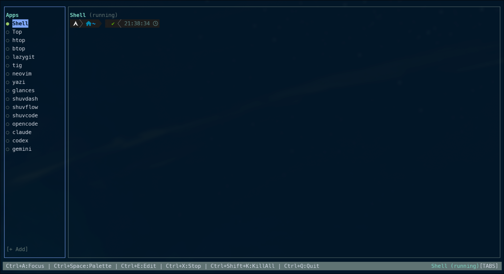
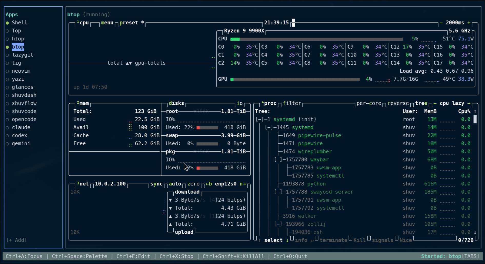
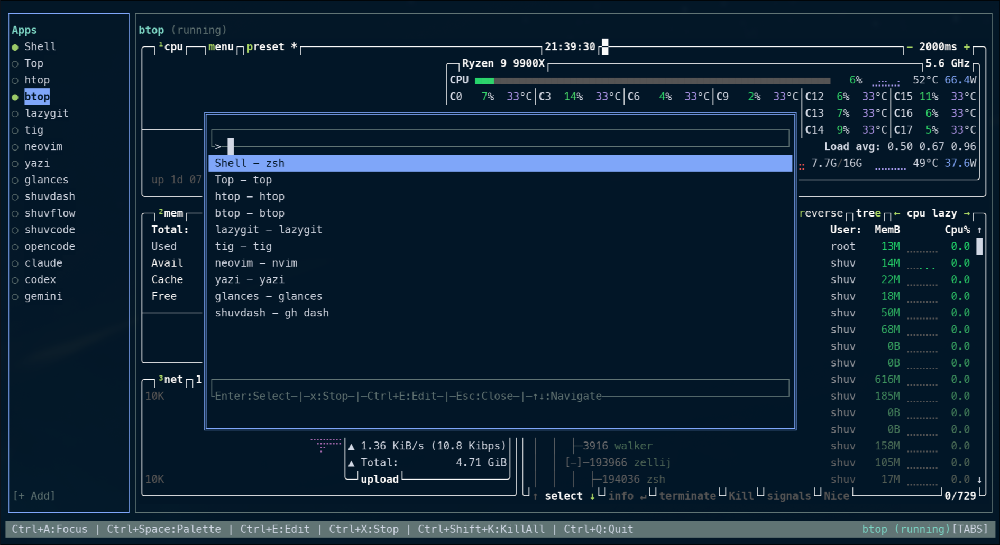

# tuidoscope

A centralized TUI management application for running multiple TUI applications in embedded terminal windows. Built with [OpenTUI](https://github.com/anomalyco/opentui) and SolidJS.

## Screenshots

### Main Interface


### Running TUI Applications


### Command Palette


### Edit App Modal


## Features

- **Embedded Terminals**: Run multiple TUIs in a single window using Ghostty's high-performance terminal emulator.
- **Tab Management**: Organize and switch between different applications using a vertical sidebar.
- **Command Palette**: Quickly search and switch between apps or perform actions with a fuzzy-search palette (Ctrl+P).
- **Runtime Management**: Add, edit, and remove application entries directly within the app without restarting.
- **Session Persistence**: Automatically remembers and restores your running applications and active tab between restarts.
- **Highly Configurable**: Customize themes, keybinds, and application lists via YAML.
- **Path Expansion**: Supports `~` and `<CONFIG_DIR>` tokens in working directory paths.

## Documentation

For detailed guides, see the [`docs/`](./docs/) directory:

- [Getting Started](./docs/getting-started.md) - Installation and first run
- [Configuration](./docs/configuration.md) - YAML config reference
- [Keybindings](./docs/keybindings.md) - Leader key system and shortcuts
- [Apps](./docs/apps.md) - App configuration examples
- [Troubleshooting](./docs/troubleshooting.md) - Common issues and solutions

## Tech Stack

- **Runtime**: [Bun](https://bun.sh/)
- **Framework**: [SolidJS](https://www.solidjs.com/)
- **TUI Engine**: [OpenTUI](https://github.com/anomalyco/opentui)
- **Terminal Emulator**: [ghostty-opentui](https://github.com/remorses/ghostty-opentui)
- **PTY**: `node-pty` (via `spawn-pty`)

## Getting Started

### Prerequisites

- [Bun](https://bun.sh/) runtime installed on your system.
- A terminal that supports TUI applications (xterm-256color recommended).

### Quick Start (No Install)

Run tuidoscope instantly without installing:

```bash
bunx tuidoscope
```

### Installation

Install globally:

```bash
bun install -g tuidoscope
```

Then run from anywhere:

```bash
tuidoscope
```

## Development

Clone the repository and install dependencies:

```bash
git clone https://github.com/shuv1337/tuidoscope.git
cd tuidoscope
bun install
```

Start the application in development mode:

```bash
bun dev
```

Build for production:

```bash
bun run build
```

Run typechecks:

```bash
bun run typecheck
```

## Configuration

Tuidoscope looks for a configuration file at `~/.config/tuidoscope/config.yaml`. It also supports a local `tuidoscope.yaml` in the current working directory for project-specific setups.

### Default Keybinds

| Action | Default Keybind |
|--------|-----------------|
| Next Tab | `Ctrl+N` |
| Previous Tab | `Ctrl+P` |
| Toggle Focus (Tabs/Terminal) | `Ctrl+A` |
| New Tab | `Ctrl+T` |
| Edit App | `Ctrl+E` |
| Command Palette | `Ctrl+Space` (or `Ctrl+P`) |
| Stop Current App | `Ctrl+X` |
| Close Tab | `Ctrl+W` |
| Restart Current App | `Ctrl+Shift+R` |
| Kill All Apps | `Ctrl+Shift+K` |
| Quit Tuidoscope | `Ctrl+Q` |

### Theme Customization

You can customize the theme in your `config.yaml`:

```yaml
theme:
  primary: "#7aa2f7"
  background: "#1a1b26"
  foreground: "#c0caf5"
  accent: "#bb9af7"
  muted: "#565f89"
```

## Change Log

### v0.1.0
- Initial release.
- Embedded terminal windows via `ghostty-opentui`.
- Vertical tab sidebar for application management.
- Command palette with fuzzy search.
- Session persistence (running apps & active tab).
- Runtime application configuration (Add/Edit).
- Path expansion for working directories.

## Acknowledgments

This project is built directly on top of:

- **[OpenTUI](https://github.com/anomalyco/opentui)** - Provides the declarative component model and rendering engine for the entire interface.
- **[ghostty-opentui](https://github.com/remorses/ghostty-opentui)** - Enables high-performance, embedded terminal sessions within the application.

Huge thanks to both for making this possible.

## License

MIT
